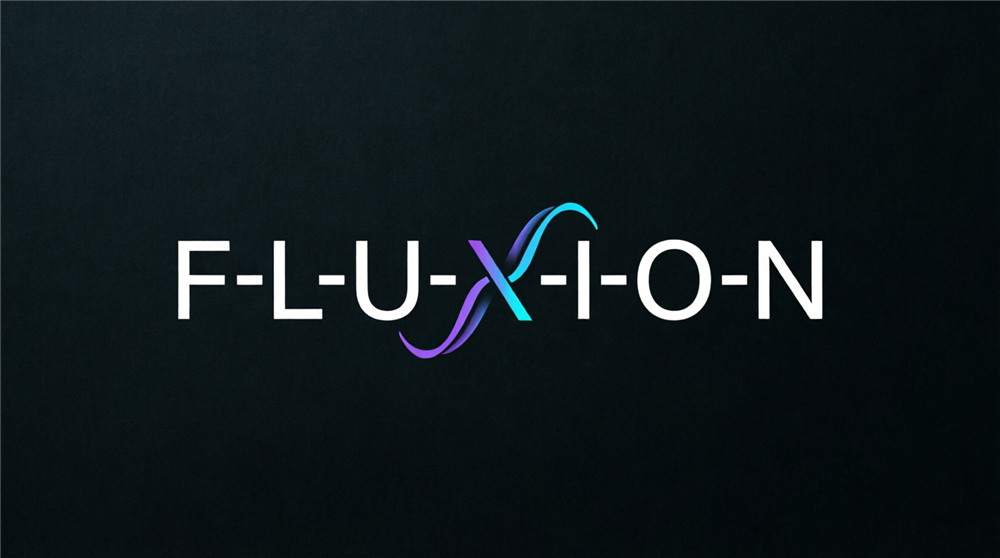

<figure markdown>
  {: style="max-width: 560px; width: 100%;" }
</figure>

**Локальный AI-ассистент для вайб-кодинга на Python**

Fluxion — полностью локальный AI-ассистент на базе Qwen2.5-Coder-7B: движок llama.cpp встроен в приложение, RAG по вашему коду, живой веб-поиск, умная маршрутизация запросов, ReAct-агент и пайплайн QLoRA-дообучения — всё на вашем компьютере, без облака. No Docker. No Ollama. No cloud. One exe.

- :material-license: **Apache 2.0**
- :material-language-python: **Python 3.11+**
- :material-home: **100% локально** — ваш код не покидает машину

## Скачать

[:material-download: Страница загрузки](../){ .md-button .md-button--primary }

Там программа для Windows (сборки **Lite** и **Full**), модели и пресеты
обучения. **Lite** — чат, агент, поиск по проекту и веб-поиск в одном exe.
**Full** = Lite + офлайн-пакет для дообучения: кнопка «Установить окружение
обучения» работает без интернета.

## Возможности

- **Multi-model** — llama.cpp (GGUF, встроен в сборку), Ollama, OpenAI-compatible API (OpenRouter, Groq, Together)
- **RAG по коду** — AST-aware чанкинг (tree-sitter), эмбеддинги bge-m3 (GGUF), ChromaDB
- **Умная маршрутизация** — rule-based Router: DIRECT / RAG / WEB / RAG_THEN_WEB
- **Веб-поиск** — SearXNG в Docker + trafilatura для чистого текста + SQLite-кэш
- **ReAct-агент** — 12 инструментов: `list_files`, `read_file` (по диапазонам строк), `grep`, `search_code` (поиск по смыслу через RAG), `write_file`, `edit_file`, `run_tests`, `web_search`, `git_status`, `git_diff`, `git_commit`, `finish`. Со встроенным llama.cpp и Ollama действия модели проверяются JSON-схемой — маленькая модель не может выдать неверный формат. Правки проверяются тестами до завершения
- **Git integration** — снимок рабочей папки перед первой правкой (ваши незакоммиченные изменения не трогаются), откат `/rollback`, коммит только изменённых агентом файлов
- **FastAPI сервер** — REST API: чат (SSE), агент, RAG-индексация, auth, billing
- **VS Code extension** — чат-сайдбар, agent mode, индексация проекта
- **QLoRA-дообучение** — unsloth (6 ГБ VRAM) или HF peft+trl (8–12 ГБ), экспорт в GGUF
- **Пайплайн данных** — CodeSearchNet, The Stack v2, MinHash-дедуп, фильтры, ChatML JSONL
- **Eval** — HumanEval / MBPP pass@k

## Архитектура

```
              ┌──────────── CLI (prompt_toolkit + rich) ────────────┐
              │   /index  /search  /web  /route  /rag  /status       │
              └───────────────────────┬──────────────────────────────┘
                                      │
                            ┌─────────▼─────────┐
                            │   Assistant       │  фасад
                            └─────────┬─────────┘
                                      │
                            ┌─────────▼─────────┐
                            │     Router        │  DIRECT/RAG/WEB
                            └──┬──────┬───────┬─┘
                               │      │       │
                    ┌───────────▼┐ ┌───▼────┐ ┌▼──────────┐
                    │ llama.cpp/ │ │  RAG   │ │ Web Search│
                    │ Ollama/API │ │ Engine │ │ (SearXNG) │
                    └────────────┘ └───┬────┘ └───────────┘
                                    │
                             ┌──────▼──────┐
                             │  ChromaDB   │  bge-m3 + tree-sitter
                             └─────────────┘
```

## Структура проекта

```
fluxion/
├── core/              # Конфигурация, backends: Ollama, API, llama.cpp, BackendFactory
├── rag/               # RAG: чанкинг, эмбеддинги, ChromaDB, индексация, поиск
├── web/               # Веб-поиск: SearXNG, fetcher, кэш, пайплайн
├── orchestrator/      # Router, PromptBuilder, Assistant, ReAct-агент, git_helper
├── server/            # FastAPI: chat (SSE), agent, rag, auth, billing
├── extension/         # VS Code extension: chat, agent, indexing
├── data_pipeline/     # Сбор данных, фильтры, дедуп, форматтер, клонер репо
├── finetune/          # QLoRA: конфиг, датасет, обучение, merge, GGUF-экспорт
├── eval/              # HumanEval / MBPP pass@k
├── cli/               # REPL, команды, рендеринг (prompt_toolkit + rich)
├── config/            # config.yaml, .env, repos.yaml, continue_config.json
├── scripts/           # setup_searxng.ps1
├── tests/             # 376+ тестов (Phases 1–13)
├── requirements.txt   # Инференс/RAG/веб/CLI
└── requirements-train.txt  # Обучение (Python 3.11/3.12)
```

## С чего начать

1. [Установка](install.md) — батники для Windows или ручная установка для любой ОС
2. [Быстрый старт](quick-start.md) — первый чат, RAG и агент
3. [Конфигурация](configuration.md) — `config.yaml`, env-переменные, multi-model
4. [API сервер](api.md) — REST/SSE endpoints
5. [Деплой](deployment.md) — Docker-образ и production compose

## Лицензия

Apache License 2.0. Copyright 2024–2026 **Djonros** `<djonros@gmail.com>`.
